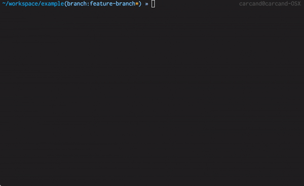

It's commonplace in the open source world to submit pull requests with clean,
logical commits appropriate to the thing you are changing.  The git history of
major projects is an important tool to track down _why_ a change was made via
detailed commit messages, who _originally_ wrote it, etc. Generally git history
in an open project is much cleaner than a closed one - much less committing of
'lolz change dis' and 'f\*\*\*ing s\*\*t why doesn't this work!?!?!?', anyway.

When you get feedback on your pull request and have to make changes to changes
(so meta), this can be either really easy or fairly complicated, depending on
your experience with git:

* **One commit**: Often you're just submitting a single change, or commits are
  asked to be "[squashed][1]" when review of a pull request is complete anyway.
  This means all changes are in a single commit and you can just [amend your
  previous commit][2] and push again.

* **Multiple commits**: Other times you might be changing enough that multiple
  commits make sense. So unless the tweak you need to make happens to be on the
  very last commit, you'll need to edit a commit back further in your git
  history.

At this point, if you don't know how to use `git commit --amend` or `git rebase
-i`, I need you to go check out [the documentation][3]. No point in
regurgitating it here. Go ahead! I'll wait right here.

...got it? The main thing you should have gotten from that is that you can
'EDIT' a particular commit. Git will replay commits on your branch until you
reach that point, at which point you can then amend it and recommit it, `git
rebase --continue` and be on your way.

## I have to do that every time?

`git rebase -i` isn't bad. Doing it often enough you can do anything fairly
quickly. But the pattern of 'I have a slight tweak I need to make in a PR, so
now I have to look up which commit it's in, go through `rebase -i` and change
it...' is so, so common.

Fortunately, git provides a neat shortcut for `rebase` to amend previous commits called `--autosquash`:

```
When the commit log message begins with "squash! ..."
(or "fixup!  ..."), and there is a commit whose title begins with the
same ..., automatically modify the todo list of rebase -i so that the
commit marked for squashing comes right after the commit to be
modified, and change the action of the moved commit from pick to
squash (or fixup).
```

What these means is that I have a commit named "Changed stuffs" and apply
another commit called "fixup! Changed stuffs", running this option will
automatically combine these two commits. There's also a `git commit --fixup=<ref>`
to automatically name the new commit properly based on the SHA you've passed.

## But...I'm very lazy.

But even _that_ solution requires you to look up the SHA of the change and pass it around. And so I present
two tools I've utilized to make rebasing changes back into a PR (or anything) completely stupid quick and easy.

* [git autofixup][4]: A custom command to commit the staged change as a fixup
  for the last commit that touched the changed line. This is crazy useful for
  preparing fixups for `git rebase --autosquash` OR...
* [git autosquash \[\<ref\>\]][5]: A custom command compliment to `autofixup`.
  Initiates an autosquash rebase on the commits in your fork (commits since the
  common ancestor between HEAD and master). You can pass in a branch or SHA to
  find the fork point with something other than the master branch.

With these tools you can now do the following, shown in the gif at the
beginning:

```
# (Make a change, add the file to your staged changes), then...

# Commits changes as a fixup for the proper previous commit
$ git autofixup

# (Optionally, keep doing the same thing with other changes...)
$ git autofixup

# Now autosquash all the things from your fork point!
$ git autosquash
```

Done! Quick. Easy. Awesome.

You can find these custom commands shared with love in [my
dotfiles](https://github.com/chrisarcand/dotfiles/tree/master/bin)

[1]: https://git-scm.com/book/en/v2/Git-Tools-Rewriting-History#Squashing-Commits
[2]: https://git-scm.com/book/en/v2/Git-Tools-Rewriting-History#Changing-the-Last-Commit
[3]: https://git-scm.com/book/en/v2/Git-Tools-Rewriting-History
[4]: https://github.com/chrisarcand/dotfiles/blob/master/bin/git-autofixup
[5]: https://github.com/chrisarcand/dotfiles/blob/master/bin/git-autosquash
