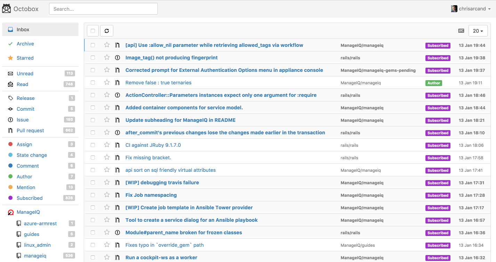

Like many open source maintainers, I have always been frustrated by the lack of
functionality with Github's notifications interface. I want to keep track of
many different projects and organizations but there just aren't good ways to
organize so many subscriptions. On top of that, the
[ManageIQ](https://github.com/ManageIQ/manageiq) project *alone* has so many
pull requests and issues filed against it in a given day (about 3x more than
[rails/rails](https://github.com/rails/rails), if you're more familiar) that
following ManageIQ/manageiq alone is simply too many notifications to
effectively browse.

Most people (I think) use emailed notifications (typically with Gmail) as a
replacement. I wanted a way to manage that further. "Use Google Apps Scripts",
people said, but I found that solution pretty hacky and lacking. [So I created
dug](https://chrisarcand.com/introducing-dug/), a Ruby gem that uses Google's
Gmail API to sort through those notifications better than the Gmail interface
itself or Google Apps Scripts could anyway.

Dug is a great little gem, and does what it intended to do. In the end though,
what I really wanted was a more native experience outside of the shackles of
email. I wasn't really daring enough to spend the time to write such a project
myself, however.

Somebody else was! Last December, [Andrew Nesbitt](https://github.com/andrew)
released what would soon be known as
[Octobox](https://github.com/octobox/octobox), an open source Rails application
that organizes your notifications using the Github Notifications API directly.

It's great!

I'd much rather spend my time helping a larger community of people than
maintaining something separate, so with people actively contributing to this
effort and Andrew being a great maintainer I've decided to stop maintaining dug
and help contribute to Octobox instead. Give a try for yourself at [octobox.io](https://octobox.io/)
